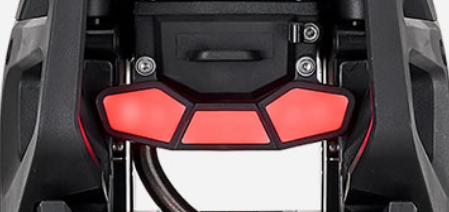

# Rear Light Hardware Analysis - Lynx S (Supposed)

The Lynx S tail light expands upon the addressable LED architecture of the original Lynx. By utilizing the previously unused third output channel of the **WS2811** controller, the Lynx S introduces discrete zones for independent turn signals and braking functions.

## 🔌 External Connectivity
The physical interface remains consistent with the LeaperKim standard for modularity.

* **Connector Type:** 3.5mm Male Jack (3-pole TRS)
* **Input Voltage:** 5V DC
* **Protocol:** Serial Data (One-wire)

## 🛠 Internal Pinout & Wiring
The wiring colors and pad labels follow the established LeaperKim convention.

| Wire Color | PCB Label | Function | Description |
| :--- | :--- | :--- | :--- |
| **Red** | **红** (Hóng) | **+5V** | Main power supply |
| **White** | **白** (Bái) | **DATA** | Serial data signal for WS2811 |
| **Black** | **黑** (Hēi) | **GND** | Ground / Negative |

---

## 🔬 Component Identification & Logic

### 1. Control Logic (WS2811)
The unit uses the same **Worldsemi WS2811** 3-channel LED driver. In this "S" configuration, the firmware sends a 24-bit data packet (RGB format) where each 8-bit segment controls a specific physical zone of the light.

### 2. Triple-Zone LED Configuration
Unlike the OG Lynx (which mirrored 2 channels and ignored the 3rd), the Lynx S likely maps the LEDs to the 3 sections shown in the housing design:

* **Channel 1 (Output R) - Left Zone:** Controls the left-most LED segment. Used for the **Left Turn Signal**.
* **Channel 2 (Output G) - Right Zone:** Controls the right-most LED segment. Used for the **Right Turn Signal**.
* **Channel 3 (Output B) - Center Zone:** Controls the larger central LED segment. Used for the **Main Brake Light and Tail Light**.

*Fig 1: The Lynx S tail light housing featuring three distinct optical sections.*

---

## 📡 Signal Behavior
Because the zones are separated at the hardware level via the WS2811, the wheel's mainboard can perform complex signaling:

1. **Running Light:** Center Zone (Channel 3) at 30% brightness.
2. **Braking:** Center Zone (Channel 3) at 100% brightness.
3. **Turning:** Channel 1 or 2 blinks while Channel 3 remains steady (Braking) or at idle (Running).
4. **Hazard Lights:** Channels 1 and 2 blink in synchronization.

---

## 💡 Modding & Reverse Engineering Notes
* **Software Mapping:** If you are using an Arduino/ESP32 to drive this light, the code should be structured as a 3-LED array.
    * `leds[0]` = Left Signal
    * `leds[1]` = Right Signal
    * `leds[2]` = Center Brake
* **Power Consumption:** By utilizing all three channels, the peak current draw is slightly higher than the OG Lynx light when all segments are active. However, it remains well within the limits of the 5V rail provided by the motherboard.
* **Compatibility:** While the connector is the same, an OG Lynx light plugged into a Lynx S (or vice versa) will result in incorrect mapping (e.g., the brake signal might only light up one side of the light).

---

### Verification Needed
* [ ] **PCB Inspection:** Confirm if the Lynx S PCB uses a single WS2811 or if multiple ICs are daisy-chained for more resolution.
* [ ] **Voltage Check:** Confirm the Center Zone LEDs are wired in a way that handles the 5V supply (likely with a current-limiting resistor or in a specific series/parallel combo).