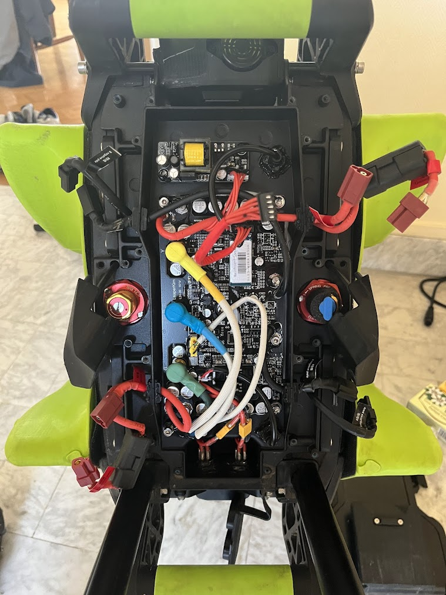

# Mainboard & Power Supply Analysis - Lynx (OG)

The LeaperKim Lynx electronics are organized into two primary sections located in the top electronics bay. The system is designed to handle a **151.2V (36S)** peak voltage, requiring high-grade isolation and robust DC-DC conversion for accessories.

## 📸 Component Overview

*Fig 1: The electronics bay showing the DC-DC Module (top) and the Mainboard (center).*

---

## ⚡ 1. Power Supply Module (DC-DC Converter)
Located at the top of the internal housing, this dedicated module is responsible for stepping down the 151V battery voltage to usable levels for the logic and accessories.

* **Primary Transformer:** Large yellow-taped high-frequency inductor for voltage buck conversion.
* **Capacitance:** High-voltage electrolytic capacitors (160V rated) provide input filtering.
* **Interface to Mainboard:** **4-pin JST Connector**.
    * This interface likely carries the regulated **24V** (for the Headlight) and **5V/12V** (for Logic/Display).

---

## 🧠 2. Main Control Board (Mainboard)

The mainboard manages motor commutation (Hall-less 3.0), sensor fusion, and communications.

### Central Processing Unit (MCU)
The board is powered by a **GigaDevice GD32F103** or **GD32F303** series ARM Cortex-M micro-controller. 
* **Role:** High-speed motor control and system logic.
* **Architecture:** Compatible with the STM32 ecosystem but generally offers higher clock speeds (up to 108MHz or 120MHz), which is critical for the "Hall-less" high-torque algorithm.

### Bluetooth Low Energy (BLE) Module
Visible as a daughterboard with a blue/white sticker labeled **"Mainboard-Lynx"**.
* **Interface:** **4-pin UART** (VCC, GND, TX, RX).
* **Role:** Communicates with the Main MCU to relay wheel data to apps (DarknessBot, EUC World) and receives firmware updates.

---

## 🔌 3. Interface & Connector Mapping
Based on PCB silkscreen and wiring analysis (Ref: `IMG_9068`, `IMG_9069`):

| Label | Pin Count | Function | Protocol / Voltage |
| :--- | :--- | :--- | :--- |
| **Power Supply Module** | **4-pin** | Input from DC-DC Converter | 24V / 5V / GND |
| **Head Light** | **3-pin** | Front projector and beeper | 24V / GND / Signal |
| **Tail Light** | **3-pin** | Rear addressable LED unit | 5V / GND / Data (WS2811) |
| **Screen** | **4-pin** | Top LCD Display | UART (VCC, GND, TX, RX) |
| **Hall** | **6-pin** | Motor Sensors (unused in Hall-less) | 5V, GND, U, V, W, Temp |
| **BLE Module** | **4-pin (Internal)**| Bluetooth Communication | UART |

---

## 🔩 4. Power Stages (Phase Wires)
The board features heavy-duty traces and screw-down terminals for the motor phase wires, labeled on the PCB:
* **G** (Green)
* **B** (Blue)
* **Y** (Yellow)

**MOSFET Configuration:**
The underside of the board (clamped to the heatsink) houses **36 MOSFETs** (TO-263 package). 
* Ref: `IMG_9066` / `IMG_9067` show the large capacitors (160V 220µF) used to buffer the phase current.

---

## 🔬 Technical Observations for Modders
1.  **Isolated Power:** The fact that the Power Supply is a separate module is good for reliability; if the DC-DC fails due to a shorted headlight, it is easier to replace/repair than if it were integrated into the mainboard.
2.  **UART Everywhere:** Since both the **Screen** and the **BLE module** use 4-pin UART, it is theoretically possible to tap into these lines to build custom telemetry displays or data loggers.
3.  **Conformal Coating:** The PCB is heavily coated in a black/clear protective resin (Ref: `IMG_9067`) to resist moisture, but the connectors themselves are standard JST and remain the primary point of entry for water.