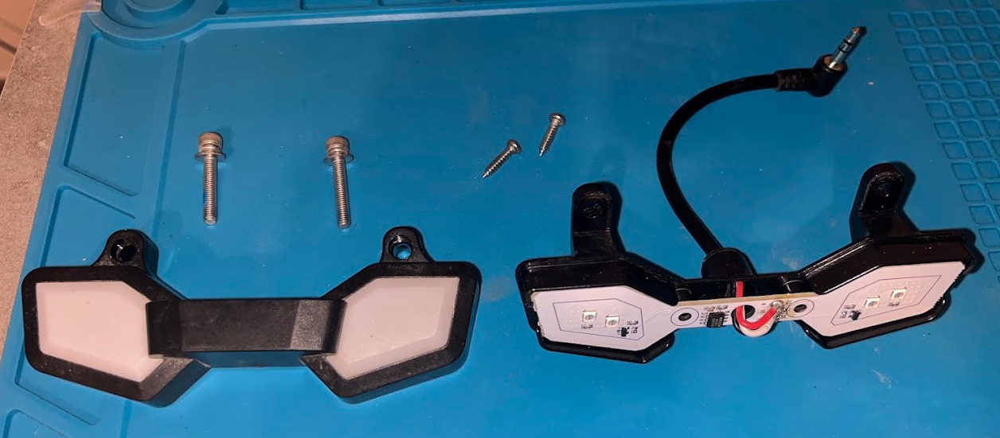
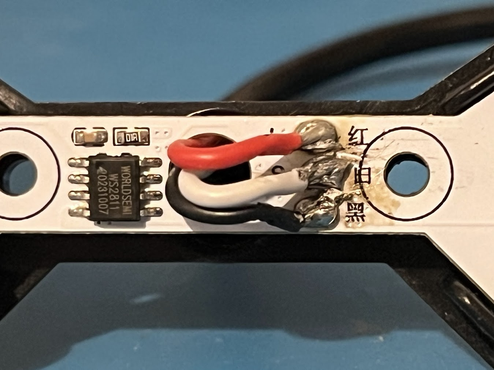
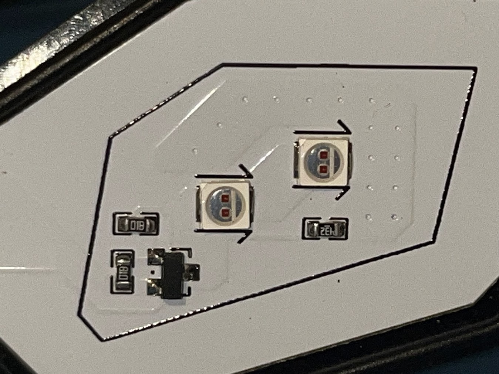
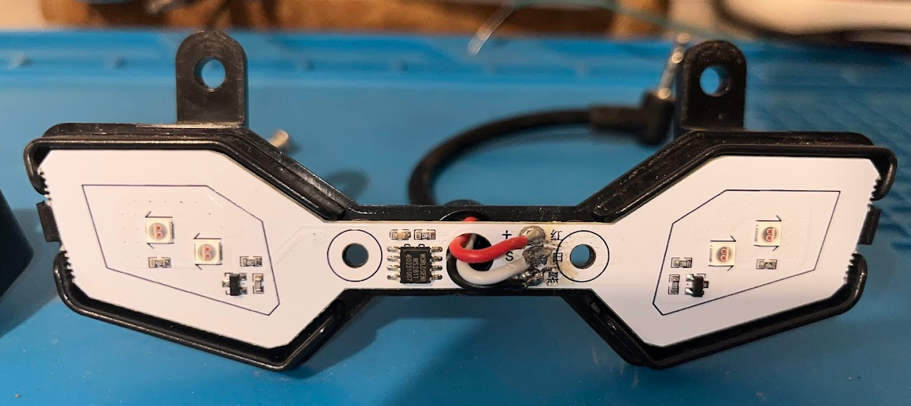

# Rear Light Hardware Analysis - Lynx (OG)

The LeaperKim Lynx tail light is an addressable LED unit housed in a custom plastic assembly. Unlike traditional "On/Off" tail lights, this unit uses a serial data protocol to allow for brightness modulation, braking signals, and blinking patterns.

## 🔌 External Connectivity
The light connects to the main wiring harness via a **3.5mm TRS (3-pole) Jack**.

* **Connector Type:** 3.5mm Male Jack
* **Input Voltage:** 5V DC

## 🛠 Internal Pinout & Wiring
The internal PCB uses standard color-coded wires soldered directly to pads with Chinese labels.

| Wire Color | PCB Label | Function | Description |
| :--- | :--- | :--- | :--- |
| **Red** | **红** (Hóng) | **+5V** | Main power supply |
| **White** | **白** (Bái) | **DATA** | Serial data signal for WS2811 |
| **Black** | **黑** (Hēi) | **GND** | Ground / Negative |

---

## 🔬 Component Identification

### 1. Control Logic (WS2811)
The heart of the rear light is the **Worldsemi WS2811** IC. 
* **Type:** 3-channel LED Driver (8-bit PWM).
* **Protocol:** Single-wire serial (NZR mode).
* **Implementation:** While the WS2811 is designed for RGB LEDs, LeaperKim uses it here as a **multi-channel dimming controller** for monochrome red LEDs.

### 2. LED Configuration (Monochrome Red)
**Important:** Contrary to typical WS2811 applications, there are **no RGB LEDs** on this board. The unit uses dedicated **Red LEDs** wired in specific clusters to the WS2811's three output channels:

* **Channel 1 (Output R):** Controls the **2 Left LEDs** (wired in series).
* **Channel 2 (Output G):** Controls the **2 Right LEDs** (wired in series).
* **Channel 3 (Output B):** **Unused**.

This wiring allows the wheel's firmware to independently control the brightness or blinking of the left and right sides of the tail light using standard RGB data packets (e.g., sending `[255, 0, 0]` would light only the left side).

---

## 📸 Technical Images

### Assembly Overview
The unit consists of the LED PCB, a translucent diffuser, and a black plastic housing secured by two main bolts and two smaller internal screws.

*Fig 1: Full disassembly of the lighting module.*

### PCB Detail & IC
The image below shows the central wiring hub and the **WS2811** controller chip. Note the specific routing from the IC to the left and right LED clusters.

*Fig 2: Close-up of the WS2811 chip and power/data input pads.*

### LED Array
Close-up of the monochrome Red SMD LEDs. Note that they only have two pins (Anode/Cathode) per LED, confirming they are not RGB.

*Fig 3: Close-up of the Red LED segments.*

### Internal Housing Fit
The PCB is shaped specifically to fit the aerodynamic "wing" style of the Lynx rear frame.

*Fig 4: PCB seated in the rear housing.*

---

## 💡 Modding Notes & Reverse Engineering
* **Logic Simulation:** To control this light with an Arduino, you would use the `FastLED` or `Adafruit_NeoPixel` library, setting the LED type to `WS2811` and the color order to `RGB`. Changing the "Red" and "Green" values in your code will toggle the left and right LED clusters respectively.
* **Non-RGB Hardware:** Since the LEDs are physically monochrome Red, you **cannot** change the color of the tail light via software. 
* **Power Limit:** The 5V rail is shared. Ensure any custom light controllers do not exceed the amperage provided by the motherboard's 5V step-down converter.